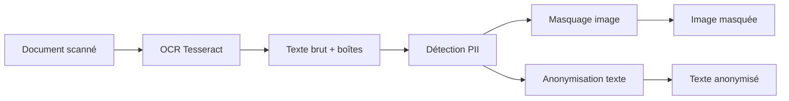
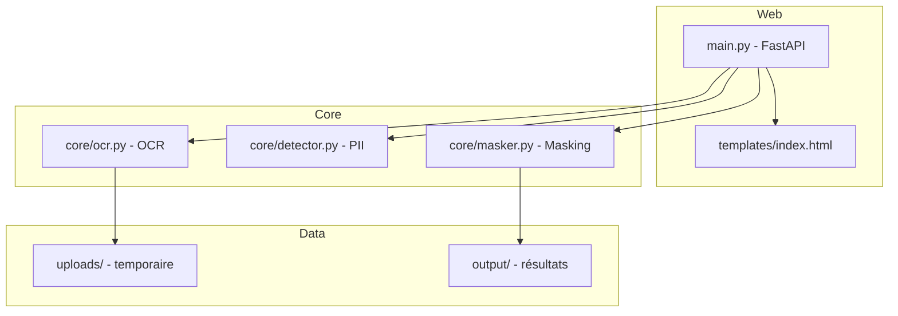
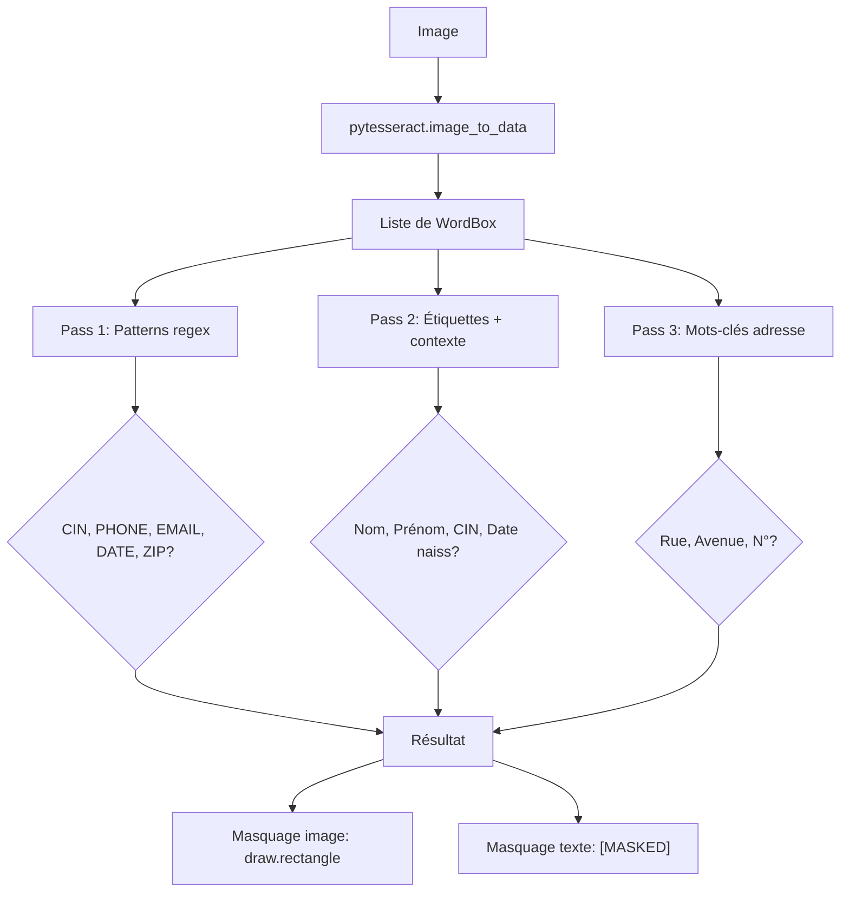

# OCR Sécurisé

Extraction de texte par OCR avec détection et masquage automatique des données sensibles.



## Tech Stack

| Composant | Technologie |
|-----------|-------------|
| OCR | Tesseract 5.4 + pytesseract |
| Backend | FastAPI + uvicorn |
| Image | Pillow |
| Détection PII | Regex (native) |
| Frontend | React 18 + create‑react‑app |
| Frontend Server | Nginx (Docker) |

## Architecture



## PII Detection Pipeline



## Installation

```bash
# Installer Tesseract (Windows)
winget install UB-Mannheim.TesseractOCR

# Installer les dépendances Python
pip install -r requirements.txt
```

## Docker

```bash
# Backend
docker build -t ocr-securise .
docker run -p 7070:7070 ocr-securise

# Frontend React (service séparé)
docker build -t ocr-frontend ./frontend
docker run -p 8080:80 ocr-frontend
```

## Utilisation

```bash
python main.py
# → http://127.0.0.1:7070
```

1. Ouvrir le navigateur sur `http://127.0.0.1:7070`
2. Importer un document (PNG/JPEG)
3. Recevoir l'image masquée + le texte anonymisé en téléchargement

## Frontend React

L'interface React se trouve dans `frontend/`. Pour développer :

```bash
cd frontend
npm install
npm start          # dev → http://localhost:3000
```

L'application React envoie les fichiers à `http://localhost:7070/upload` (backend FastAPI). Assurez-vous que le backend tourne.

Pour construire l'image Docker :

```bash
docker build -t ocr-frontend ./frontend
docker run -p 8080:80 ocr-frontend   # → http://localhost:8080
```

## Détection des champs sensibles

| Type | Méthode |
|------|---------|
| CIN | `\b\d{8,12}\b` + étiquettes `cin:`, `n°cin` |
| Téléphone | `\b0[1-9](?:\s?\d{2}){4}\b` |
| Email | `\b[\w.+-]+@[\w-]+\.[\w.]+\b` |
| Date naissance | `\b\d{1,2}[\s/-]\d{1,2}[\s/-]\d{2,4}\b` |
| Nom/Prénom | Capture après `nom:`, `prénom:` |
| Adresse | Mots-clés `rue`, `avenue`, `boulevard`, `N°` |

## Structure du projet

```
ocr-securise/
├── main.py                 # Point d'entrée FastAPI
├── core/
│   ├── ocr.py              # OCR → texte + boîtes
│   ├── detector.py         # Détection PII par regex
│   └── masker.py           # Masquage image + texte
├── templates/
│   └── index.html          # Interface web (Jinja2)
├── frontend/               # React UI
│   ├── package.json
│   ├── Dockerfile
│   ├── public/
│   │   └── index.html
│   └── src/
│       ├── App.js
│       ├── App.css
│       └── index.js
├── Dockerfile
├── requirements.txt
├── integration_test.py     # Tests
└── README.md
```
